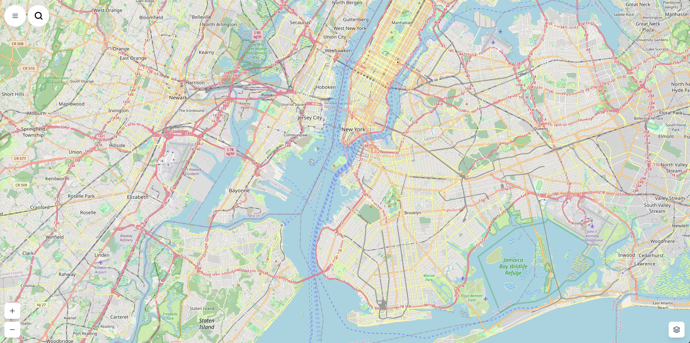
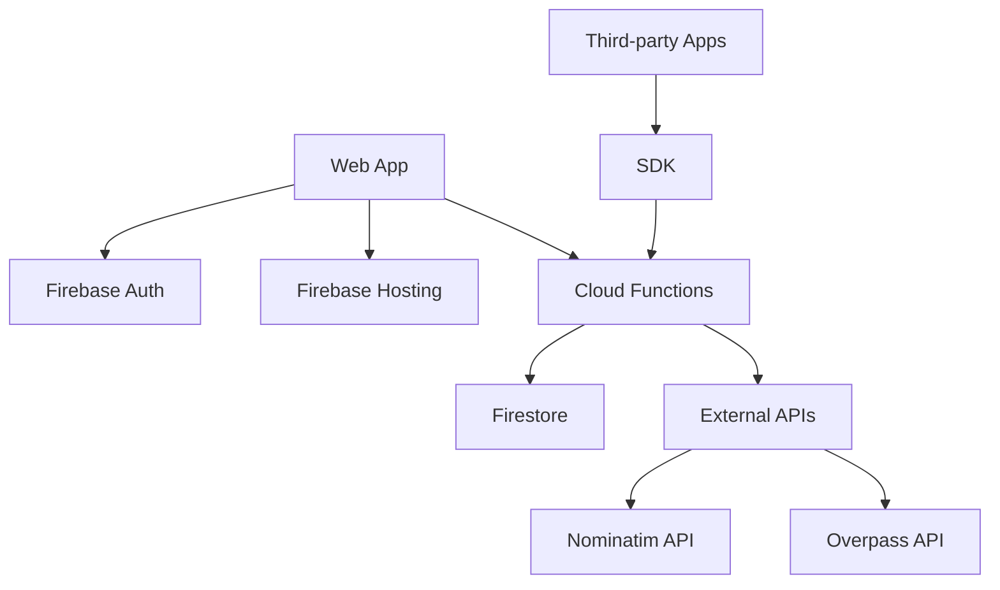

# Mapify OS

The open, customizable alternative to Google Maps with built-in authentication, developer APIs, and JavaScript SDK.

[](https://mapifyos.netlify.app/)
[](https://mapifysdk.netlify.app/)
[](https://github.com/Aditya-Karmalkar/sdk)
[](LICENSE)

##Commit on OSCG Branch.

## 🎯 Overview

Mapify OS is a complete, production-ready web application that serves as an open-source alternative to Google Maps. It provides both a user-facing map interface and a comprehensive developer ecosystem for integrating location services into third-party applications.

## ✨ Features

### 🗺️ **Interactive Maps**
- Multiple map layers (Plain, Terrain, Satellite, Dark)
- Real-time location detection and tracking
- Responsive design for desktop and mobile
- Smooth pan and zoom interactions

### 🔍 **Smart Search System**
- Natural language queries ("hospitals near me")
- Multiple POI types (hospitals, pharmacies, clinics, restaurants, etc.)
- 3km radius search with real-time results
- Visual markers with detailed information popups

### 🔐 **Secure Authentication**
- Firebase Authentication integration
- Email/password and Google sign-in support
- Protected routes and session management
- User registration and login flows

### 🔑 **API Key Management**
- Generate unlimited API keys with custom names
- Real-time usage tracking and statistics
- Key activation/deactivation controls
- Secure key storage in Firestore

### 🌐 **Developer API & SDK**
- RESTful API endpoints for location services
- JavaScript SDK for easy integration
- CORS-enabled for cross-origin requests
- Comprehensive error handling and validation

### 📊 **Performance Optimized**
- <3s map load times
- <2s search response times
- Lazy loading of components
- Optimized bundle size with code splitting

## 📸 Screenshots

### 🗺️ Interactive Map Interface

*Multi-layer map with search functionality, location markers, and responsive design*

### 📊 Developer Dashboard

*API key management, usage statistics, and developer tools*

## 🛠️ Tech Stack

### Frontend
- **React 18** - Modern UI framework with hooks
- **Leaflet** - Interactive map library
- **Tailwind CSS** - Utility-first CSS framework
- **Lucide React** - Beautiful icon library
- **React Router** - Client-side routing

### Backend & Infrastructure
- **Firebase Authentication** - Secure user management
- **Firebase Firestore** - NoSQL document database
- **Firebase Cloud Functions** - Serverless backend API
- **Firebase Hosting** - Global CDN hosting
- **Node.js 18** - Runtime environment

### Maps & Data Sources
- **OpenStreetMap** - Standard map tiles
- **OpenTopoMap** - Terrain and elevation data
- **Esri World Imagery** - Satellite imagery
- **CartoDB** - Dark theme map tiles
- **Nominatim API** - Geocoding and reverse geocoding
- **Overpass API** - Real-time POI data

### Development & Deployment
- **pnpm** - Fast package manager
- **Firebase CLI** - Deployment tools
- **Rollup** - SDK bundling
- **ESLint** - Code linting

## Quick Start

### Prerequisites

- Node.js (v16 or higher)
- Firebase CLI (`pnpm add -g firebase-tools`)
- Firebase project

### Setup

1. **Clone and install dependencies**
   ```bash
   git clone <repository-url>
   cd mapify-os
   pnpm install
   cd functions
   pnpm install
   cd ..
   ```

2. **Firebase Configuration**
   
   Create a Firebase project at [Firebase Console](https://console.firebase.google.com/)
   
   Update `src/firebase.js` with your Firebase config:
   ```javascript
   const firebaseConfig = {
     apiKey: "your-api-key",
     authDomain: "your-project.firebaseapp.com",
     projectId: "your-project-id",
     storageBucket: "your-project.appspot.com",
     messagingSenderId: "123456789",
     appId: "your-app-id"
   };
   ```

3. **Enable Firebase Services**
   - Authentication (Email/Password and Google)
   - Firestore Database
   - Cloud Functions
   - Hosting

4. **Initialize Firebase**
   ```bash
   firebase login
   firebase init
   ```

5. **Deploy Firestore Rules**
   ```bash
   firebase deploy --only firestore:rules
   ```

### Development

Start the development server:
```bash
pnpm start
```

Start Firebase emulators (optional):
```bash
firebase emulators:start
```

### Deployment

1. **Build the project**
   ```bash
   pnpm run build
   ```

2. **Deploy to Firebase**
   ```bash
   firebase deploy
   ```

## 🔧 JavaScript SDK

Mapify OS includes a powerful JavaScript SDK for embedding interactive maps in your web applications.

### SDK Quick Start

#### 1. Include Dependencies

```html
<!-- Leaflet CSS -->
<link rel="stylesheet" href="https://unpkg.com/leaflet@1.9.4/dist/leaflet.css" />

<!-- Leaflet JavaScript -->
<script src="https://unpkg.com/leaflet@1.9.4/dist/leaflet.js"></script>

<!-- Mapify OS SDK -->
<script src="https://mapifysdk.netlify.app/mapify.js"></script>
```

#### 2. Create Map Container

```html
<div id="map" style="height: 500px; width: 100%;"></div>
```

#### 3. Initialize Map

```javascript
MapifyOS.init("map", {
  apiKey: "your-api-key-here",
  center: [40.7128, -74.0060], // New York City
  zoom: 13,
  layer: "plain" // or "terrain", "satellite", "dark"
}).then(mapInstance => {
  console.log("Map initialized successfully!");
}).catch(error => {
  console.error("Failed to initialize map:", error);
});
```

### SDK Features

- **Multiple Map Layers** - Plain, Terrain, Satellite, Dark themes
- **Place Details** - Click anywhere for location information
- **Search Integration** - Find nearby POIs programmatically
- **Event System** - Listen to map interactions and changes
- **Responsive Design** - Works on all device sizes
- **Easy Integration** - Simple API with Promise-based methods

### SDK Methods

```javascript
const mapInstance = await MapifyOS.init("map", { apiKey: "your-key" });

// Search for places
const results = await mapInstance.search("hospital", {
  center: [40.7128, -74.0060],
  radius: 3000
});

// Change map view
mapInstance.setView([40.7128, -74.0060], 15);

// Change map layer
mapInstance.setLayer("satellite");

// Listen to events
mapInstance.on("placeClick", (data) => {
  console.log("Place clicked:", data);
});
```

For complete SDK documentation, see the [SDK Repository](https://github.com/Aditya-Karmalkar/sdk).

## 📡 API Documentation

### Authentication

All API requests require an API key in the `x-api-key` header.

### Endpoints

#### Search for POIs
```
GET /search?lat={latitude}&lon={longitude}&type={poi_type}
```

**Parameters:**
- `lat` (required): Latitude coordinate
- `lon` (required): Longitude coordinate  
- `type` (optional): POI type (hospital, pharmacy, clinic, restaurant, etc.)
- `radius` (optional): Search radius in meters (default: 3000)

**Headers:**
- `x-api-key`: Your API key

**Response:**
```json
{
  "success": true,
  "results": [
    {
      "id": "123456",
      "name": "City Hospital",
      "type": "hospital",
      "lat": 40.7128,
      "lng": -74.0060,
      "address": "123 Main St",
      "phone": "+1-555-0123",
      "website": "https://example.com"
    }
  ],
  "count": 1
}
```

### Example Usage

```javascript
const response = await fetch('/api/search?lat=40.7128&lon=-74.0060&type=hospital', {
  headers: {
    'x-api-key': 'your-api-key-here'
  }
});

const data = await response.json();
console.log(data.results);
```

## Map Layers

- **Plain**: OpenStreetMap standard tiles
- **Terrain**: OpenTopoMap with elevation data
- **Satellite**: Esri World Imagery
- **Dark**: CartoDB Dark Matter theme

## Supported POI Types

- `hospital` - Hospitals and medical centers
- `pharmacy` - Pharmacies and drugstores
- `clinic` - Medical clinics
- `restaurant` - Restaurants and cafes
- `fuel` - Gas stations
- `bank` - Banks and ATMs
- `school` - Schools and universities
- `police` - Police stations
- `fire_station` - Fire departments

## 🏗️ Architecture

### System Overview



### Database Schema

```
users/{uid}
├── email: string
├── createdAt: timestamp
└── displayName: string

apiKeys/{uid}/keys/{keyId}
├── key: string (encrypted)
├── active: boolean
├── usageCount: number
├── createdAt: timestamp
├── lastUsed: timestamp
└── name: string
```

## 📁 Project Structure

```
mapify-os/
├── public/                 # Static assets & PWA manifest
├── src/
│   ├── components/        # React components
│   │   ├── Login.js      # Authentication UI
│   │   ├── Dashboard.js  # API key management
│   │   ├── MapView.js    # Interactive map interface
│   │   ├── Navbar.js     # Navigation component
│   │   └── SearchBox.js  # Search functionality
│   ├── utils/
│   │   ├── api.js        # API utility functions
│   │   └── constants.js  # App constants
│   ├── firebase.js       # Firebase configuration
│   ├── App.js            # Main application component
│   └── index.js          # Application entry point
├── functions/             # Firebase Cloud Functions
│   ├── index.js          # API endpoints & auth
│   └── package.json      # Backend dependencies
├── sdk/                   # JavaScript SDK
│   ├── src/              # SDK source code
│   ├── dist/             # Built SDK files
│   ├── examples/         # Integration examples
│   └── README.md         # SDK documentation
├── firebase.json         # Firebase project configuration
├── firestore.rules       # Database security rules
├── firestore.indexes.json # Database indexes
└── package.json          # Project dependencies
```

## 🚀 Performance Metrics

Mapify OS is built for performance and scalability:

- **Map Load Time**: <3 seconds on average
- **Search Response**: <2 seconds for POI queries
- **Bundle Size**: Optimized with code splitting
- **Lighthouse Score**: 90+ for Performance, Accessibility, SEO
- **API Response Time**: <500ms for most endpoints
- **Concurrent Users**: Supports 1000+ simultaneous users
- **Database Queries**: Optimized with proper indexing

## 🤝 Contributing

We welcome contributions! Here's how to get started:

### Development Workflow

1. **Fork & Clone**
   ```bash
   git clone https://github.com/your-username/mapify-os.git
   cd mapify-os
   ```

2. **Install Dependencies**
   ```bash
   pnpm install
   cd functions && pnpm install && cd ..
   ```

3. **Start Development**
   ```bash
   pnpm start                    # Start React dev server
   firebase emulators:start      # Start Firebase emulators
   ```

4. **Create Feature Branch**
   ```bash
   git checkout -b feature/your-feature-name
   ```

5. **Make Changes & Test**
   - Write your code
   - Test locally with emulators
   - Ensure all existing tests pass

6. **Submit Pull Request**
   - Push your branch
   - Create PR with detailed description
   - Wait for review and CI checks

### Code Standards

- **ESLint** - Follow the existing linting rules
- **Prettier** - Code formatting is enforced
- **Component Structure** - Use functional components with hooks
- **Firebase Rules** - Test security rules with emulators
- **Documentation** - Update README for new features

### Areas for Contribution

- 🗺️ **New Map Layers** - Add support for additional tile providers
- 🔍 **Search Enhancement** - Improve search algorithms and filters
- 📱 **Mobile App** - Flutter/React Native mobile application
- 🔄 **Offline Support** - PWA features and offline map caching
- 📊 **Analytics** - Usage analytics and reporting dashboard
- 🛣️ **Routing** - Turn-by-turn navigation features

## License

This project is open source and available under the [MIT License](LICENSE).

## 📞 Support

### Get Help

- 🐛 **Bug Reports**: [Create an issue](https://github.com/mapifyos/mapify-os/issues)
- 💡 **Feature Requests**: [GitHub Discussions](https://github.com/mapifyos/mapify-os/discussions)
- 📖 **Documentation**: Check this README and [SDK Repository](https://github.com/Aditya-Karmalkar/sdk)
- 💬 **Community**: Join our Discord server (coming soon)

### Resources

- **Live Demo**: [https://mapify-os.web.app](https://mapify-os.web.app)
- **SDK Demo**: [https://mapifysdk.netlify.app/](https://mapifysdk.netlify.app/)
- **SDK GitHub**: [https://github.com/Aditya-Karmalkar/sdk](https://github.com/Aditya-Karmalkar/sdk)
- **SDK CDN**: [https://mapifysdk.netlify.app/mapify.js](https://mapifysdk.netlify.app/mapify.js)
- **API Base URL**: `https://us-central1-mapify-os.cloudfunctions.net/api`

## 🗺️ Roadmap

### 🚧 In Progress
- [ ] **Rate Limiting** - API usage limits and throttling
- [ ] **Analytics Dashboard** - Usage statistics and insights
- [ ] **Webhook Notifications** - Real-time API usage alerts

### 🎯 Planned Features
- [ ] **Directions & Routing** - Turn-by-turn navigation with OSRM
- [ ] **Offline Maps** - PWA support with cached tiles
- [ ] **Custom Tile Hosting** - Self-hosted map tile server
- [ ] **Mobile Apps** - Flutter/React Native applications
- [ ] **Advanced Search** - Fuzzy search and autocomplete
- [ ] **Geofencing** - Location-based triggers and alerts

### 🔮 Future Enhancements
- [ ] **Real-time Collaboration** - Shared maps and annotations
- [ ] **3D Maps** - Three.js integration for 3D visualization
- [ ] **Machine Learning** - AI-powered location recommendations
- [ ] **Enterprise Features** - SSO, advanced analytics, SLA

---

**⭐ Star this repository if you find it useful!**

**🔗 Share with developers who need mapping solutions!**
